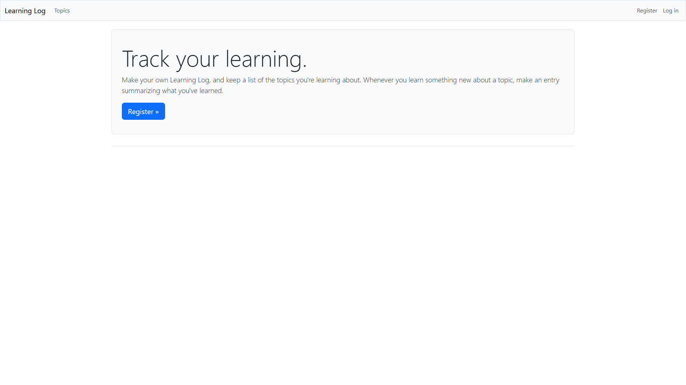

# Learning Log


Learning Log is a full-stack web application built with Python and Django. Developed as the final project from the book "Python Crash Course, 3rd Edition," this application functions as a online journal where multiple isolated users can keep journals on what they are learning about.

The core purpose of this project is to build a complete, database-driven web application from the ground up, demonstrating practical understanding of core back-end development principles. It showcases everything from database modeling to user authentication and data management.

Instead of using Platform.sh (as recommended in the book), this project uses Docker for deployment. Platform.sh is a cloud-based Platform-as-a-Service (PaaS) that simplifies hosting and managing web applications, but it requires users to sign up for their service, which may not be ideal for all scenarios. Docker provides a highly portable, containerized environment that can be run consistently on any system or service that supports Docker. This approach allows for easy local development, testing, and deployment to a wide range of platforms, both on-premises and in the cloud, without being tied to a specific hosting provider.


## Key Features
- User registration and authentication
- Create, view, and edit learning topics
- Add and manage entries for each topic
- Simple, user-friendly interface
- Dockerized for easy deployment

## Getting Started
1. Clone the repository:
	```sh
	git clone https://github.com/CthulhuIsRight/python-crash-course-3rd-edition-django-learning-log-project.git
	cd python-crash-course-3rd-edition-django-learning-log-project
	```
2. Create a `.env` file in the project root with the following variables:
	```env
	SECRET_KEY=your_secret_key
	DEBUG=1
	POSTGRES_DB=learning_log_db
	POSTGRES_USER=learning_log_user
	POSTGRES_PASSWORD=your_db_password
	```
3. Build and run with Docker Compose (recommended):
	```sh
	docker compose build
	docker compose up
	```
	Or, to use plain Docker:
	```sh
	docker build -t learning-log .
	docker run -d -p 8000:8000 --env-file .env learning-log
	```
4. Run database migrations to set up the database schema:
	```sh
	docker compose exec web python manage.py migrate
	```
5. Visit [http://localhost:8000](http://localhost:8000) in your browser.

## Usage
- Register for an account or log in at [http://localhost:8000](http://localhost:8000).
- Create new topics to track what you are learning.
- Add entries to each topic as you make progress.
- Edit or delete your topics and entries as needed.

## Project Notes
- **Dockerized Setup:** Uses Docker Compose with two main services: Django web app and Postgres database.
- **Environment Variables:** Required for database credentials and Django settings. See `.env` example above.
- **Database Persistence:** Data is stored in a Docker volume. Running `docker compose down -v` deletes all data; `docker compose down` (without `-v`) keeps it. For production, configure named Docker volumes or external storage for database persistence.
- **Backup/Restore:** To back up your database volume, use `docker run --rm -v <volume_name>:/volume -v %cd%:/backup busybox tar czf /backup/backup.tar.gz -C /volume .` (Windows) or the equivalent for your OS. Restore by reversing the process.
- **Dependencies:** Python 3.10, Django 5.2.5, Gunicorn, Postgres, and other packages in `requirements.txt`.
- **Static Files:** Collected automatically during Docker build.
- **Admin Tasks:**
	- To access the Django admin, create a superuser:
		```sh
		docker compose exec web python manage.py createsuperuser
		```
	- Then visit [http://localhost:8000/admin/](http://localhost:8000/admin/).

## Troubleshooting
- **500 Server Error after wiping containers/volumes:**
	- If you run `docker compose down -v` (or `docker-compose down -v`), all database data is deleted. After bringing the containers back up, you must re-run migrations to recreate the database schema:
		```sh
		docker compose exec web python manage.py migrate
		```
	- If you do not remove volumes, migrations are only needed when you change your Django models.
- **General errors or persistent issues:**
	- Check the logs for the web service to get more details:
		```sh
		docker compose logs web
		```
	- This can help identify missing environment variables, database connection issues, or other problems. If this produces no results, try migration.

## Contributing
Contributions are welcome, even if this is a tutorial project. Feel free to open issues or submit pull requests.

## License
This project is licensed under the [MIT License](LICENSE).